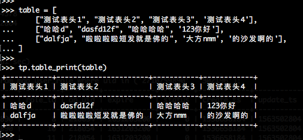

=============
terminalprint
=============

Quickstart
----------

Install::

    pip install terminalprint

Usage::

    >>> table = [
    ...     ['Heading1', 'Heading2'],
    ...     ['row1 column1', 'row1 column2'],
    ...     ['row2 column1', 'row2 column2'],
    ...     ['row3 column1', 'row3 column2']
    ... ]
    >>> 
    >>> import terminalprint as tp
    >>> tp.table_print(table)
    +--------------+--------------+
    | Heading1     | Heading2     |
    +--------------+--------------+
    | row1 column1 | row1 column2 |
    | row2 column1 | row2 column2 |
    | row3 column1 | row3 column2 |
    +--------------+--------------+
    >>> 

Example
-------

